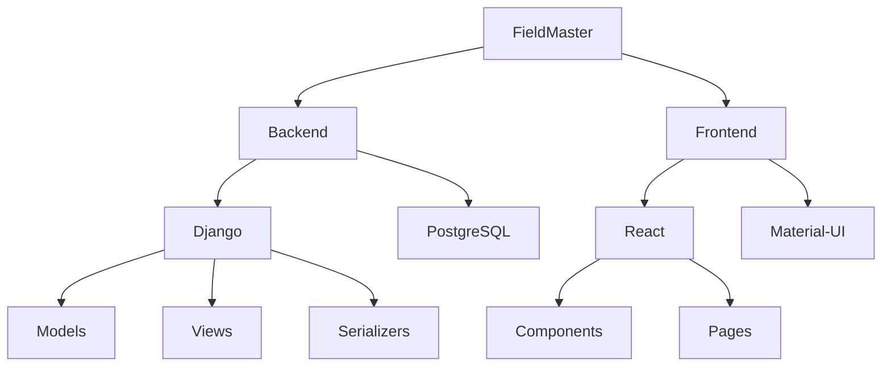
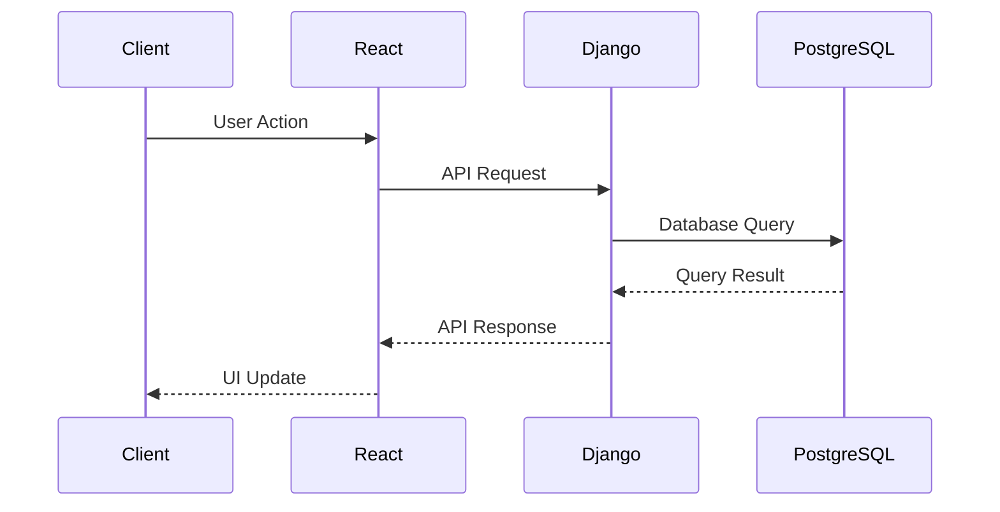
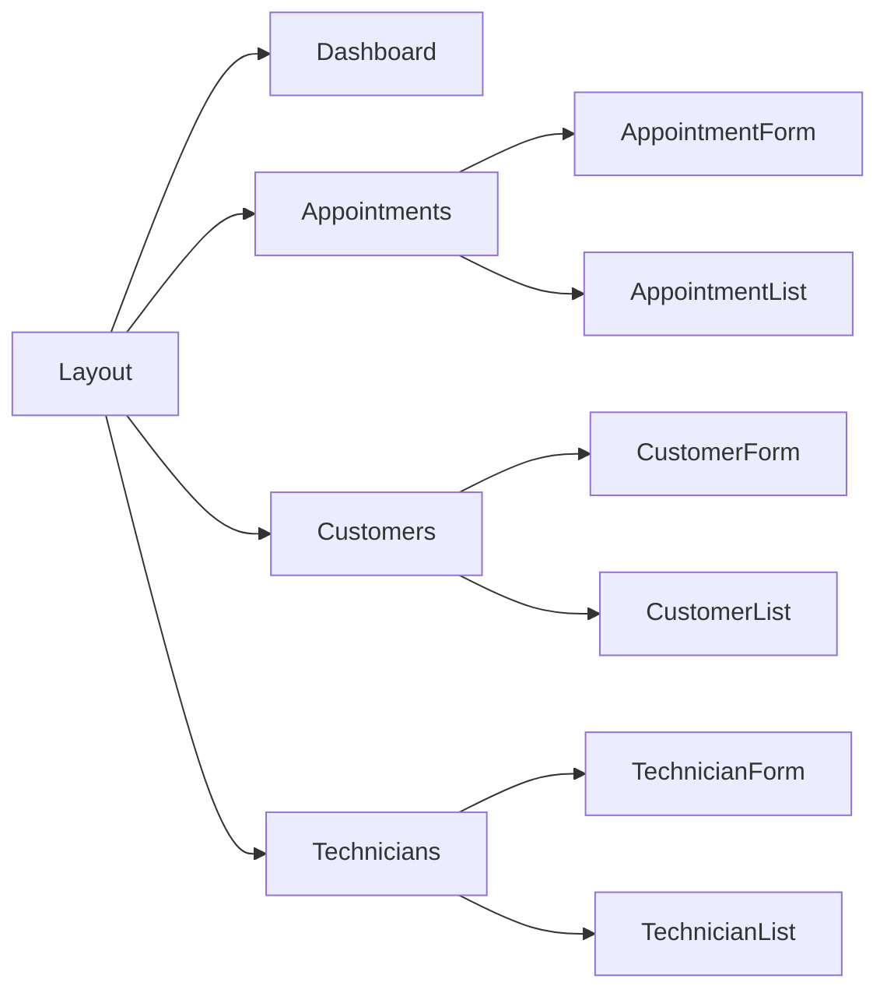

# FieldMaster Appointment System Documentation

## Project Structure Overview



## Backend Structure

### Django Project Files

#### `fieldmaster/settings.py`
```python
# Database Configuration
DATABASES = {
    'default': {
        'ENGINE': 'django.db.backends.postgresql',
        'NAME': 'fieldmaster',
        'USER': 'postgres',
        'PASSWORD': 'password',
        'HOST': 'localhost',
        'PORT': '5432',
    }
}

# REST Framework Settings
REST_FRAMEWORK = {
    'DEFAULT_AUTHENTICATION_CLASSES': [
        'rest_framework.authentication.SessionAuthentication',
        'rest_framework.authentication.BasicAuthentication',
    ],
    'DEFAULT_PERMISSION_CLASSES': [
        'rest_framework.permissions.IsAuthenticated',
    ],
}
```

#### `fieldmaster/urls.py`
- **Purpose**: Main URL routing configuration
- **Structure**:
  - Admin interface URL
  - API endpoints routing
  - Media file serving configuration

### Appointments App

#### `appointments/models.py`
```python
class Appointment(models.Model):
    STATUS_CHOICES = [
        ('scheduled', 'Scheduled'),
        ('in_progress', 'In Progress'),
        ('completed', 'Completed'),
        ('cancelled', 'Cancelled'),
    ]

    PRIORITY_CHOICES = [
        ('low', 'Low'),
        ('medium', 'Medium'),
        ('high', 'High'),
        ('emergency', 'Emergency'),
    ]

    customer = models.ForeignKey(Customer, on_delete=models.CASCADE)
    technician = models.ForeignKey(Technician, on_delete=models.SET_NULL, null=True)
    appointment_date = models.DateField()
    start_time = models.TimeField()
    end_time = models.TimeField()
    status = models.CharField(max_length=20, choices=STATUS_CHOICES)
    priority = models.CharField(max_length=20, choices=PRIORITY_CHOICES)
```

#### `appointments/serializers.py`
- **Purpose**: Converts model instances to JSON and vice versa
- **Serializers**:
  - `CustomerSerializer`: Handles customer data serialization
  - `TechnicianSerializer`: Handles technician data serialization
  - `AppointmentSerializer`: Handles appointment data serialization
  - `AppointmentPhotoSerializer`: Handles photo data serialization

#### `appointments/views.py`
```python
class AppointmentViewSet(viewsets.ModelViewSet):
    queryset = Appointment.objects.all()
    serializer_class = AppointmentSerializer
    permission_classes = [IsAuthenticated]

    @action(detail=True, methods=['post'])
    def upload_photo(self, request, pk=None):
        appointment = self.get_object()
        serializer = AppointmentPhotoSerializer(data=request.data)
        if serializer.is_valid():
            serializer.save(appointment=appointment)
            return Response(serializer.data)
        return Response(serializer.errors)
```

#### `appointments/urls.py`
- **Purpose**: Defines API endpoint URLs
- **Routes**:
  - `/api/customers/`
  - `/api/technicians/`
  - `/api/appointments/`
  - `/api/photos/`

#### `appointments/admin.py`
- **Purpose**: Configures the Django admin interface
- **Admin Classes**:
  - `CustomerAdmin`: Customizes customer admin view
  - `TechnicianAdmin`: Customizes technician admin view
  - `AppointmentAdmin`: Customizes appointment admin view
  - `AppointmentPhotoAdmin`: Customizes photo admin view

## Frontend Structure

### React App Files

#### `frontend/src/App.js`
```javascript
function App() {
  return (
    <ThemeProvider theme={theme}>
      <CssBaseline />
      <Router>
        <Layout>
          <Routes>
            <Route path="/" element={<Dashboard />} />
            <Route path="/appointments" element={<Appointments />} />
            <Route path="/customers" element={<Customers />} />
            <Route path="/technicians" element={<Technicians />} />
          </Routes>
        </Layout>
      </Router>
    </ThemeProvider>
  );
}
```

#### `frontend/src/components/Layout.js`
- **Purpose**: Main layout component with navigation
- **Features**:
  - Responsive drawer
  - App bar with title
  - Navigation menu
  - Mobile-friendly design

### Page Components

#### `frontend/src/pages/Dashboard.js`
- **Purpose**: Main dashboard page
- **Features**:
  - Appointment statistics
  - Calendar view
  - Status cards
  - Event styling based on status

#### `frontend/src/pages/Appointments.js`
```javascript
function Appointments() {
  const [appointments, setAppointments] = useState([]);
  const [open, setOpen] = useState(false);
  const [formData, setFormData] = useState({
    customer: '',
    technician: '',
    appointment_date: new Date(),
    start_time: new Date(),
    end_time: new Date(),
    status: 'scheduled',
    priority: 'medium',
  });

  const handleSubmit = async (e) => {
    e.preventDefault();
    try {
      const response = await fetch('http://localhost:8000/api/appointments/', {
        method: 'POST',
        headers: {
          'Content-Type': 'application/json',
        },
        body: JSON.stringify(formData),
      });
      if (response.ok) {
        fetchAppointments();
        handleClose();
      }
    } catch (error) {
      console.error('Error saving appointment:', error);
    }
  };
}
```

#### `frontend/src/pages/Customers.js`
- **Purpose**: Customer management page
- **Features**:
  - Customer list view
  - Create/edit customer form
  - Contact information management
  - Address management

#### `frontend/src/pages/Technicians.js`
- **Purpose**: Technician management page
- **Features**:
  - Technician list view
  - Create/edit technician form
  - Availability management
  - User account management

## Configuration Files

### `requirements.txt`
- **Purpose**: Lists Python package dependencies
- **Key Dependencies**:
  - Django
  - Django REST Framework
  - Django CORS Headers
  - Pillow (for image handling)
  - psycopg2-binary (PostgreSQL adapter)
  - python-dotenv (environment variables)

### `frontend/package.json`
- **Purpose**: Lists Node.js package dependencies
- **Key Dependencies**:
  - React
  - Material-UI
  - React Router
  - React Big Calendar
  - Date handling libraries

### `.env`
- **Purpose**: Environment variables configuration
- **Variables**:
  - DEBUG mode
  - Secret key
  - Allowed hosts
  - Database URL

### `.gitignore`
- **Purpose**: Specifies files to ignore in version control
- **Categories**:
  - Python-specific files
  - Node.js files
  - Environment files
  - IDE configurations
  - OS-specific files

## README.md
- **Purpose**: Project documentation and setup instructions
- **Sections**:
  - Features overview
  - Setup instructions
  - API endpoints
  - Development guidelines
  - License information

## Data Flow Diagram



## Component Relationships

