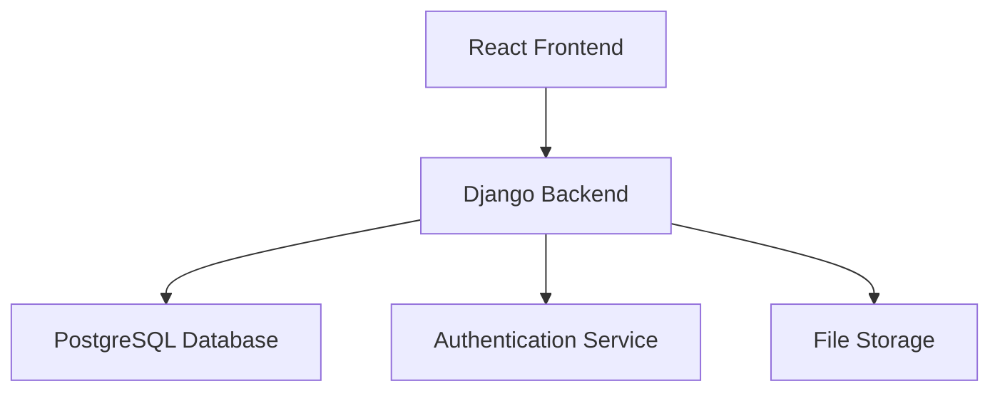

# FieldMaster Documentation

## Overview
FieldMaster is a comprehensive field service management system designed to streamline appointment scheduling, customer management, and billing operations. The system is built using Django for the backend and React for the frontend.

## System Architecture



## Core Features

### 1. Appointment Management
- Create, edit, and delete appointments
- Assign technicians to appointments
- Set appointment priorities (Low, Medium, High, Emergency)
- Track appointment status (Scheduled, In Progress, Completed, Cancelled)
- Automatic bill creation for new appointments
- Date and time handling with proper validation
- Default time slots (9 AM - 10 AM) for unknown times
- Graceful error handling for time input issues

### 2. Customer Management
- Comprehensive customer profiles
- Contact information management
- Service history tracking
- Support for walk-in/cash customers
- Quick customer creation from billing interface
- Customer search and filtering

### 3. Billing System
- Support for both bills and estimates
- Line item management with automatic calculations
- Multiple status tracking (Draft, Sent, Paid, Overdue, Cancelled)
- Optional customer association
- Employee name tracking
- Due date management
- Notes and descriptions
- Automatic total calculation
- Support for walk-in/cash customers
- Quick customer creation from bill form
- Notes display on bill cards

### 4. Technician Management
- Technician profiles with availability tracking
- Assignment to appointments
- Performance metrics
- Schedule management

## API Endpoints

### Appointments
- `GET /api/appointments/` - List all appointments
- `POST /api/appointments/` - Create new appointment
- `GET /api/appointments/{id}/` - Get appointment details
- `PUT /api/appointments/{id}/` - Update appointment
- `DELETE /api/appointments/{id}/` - Delete appointment

### Customers
- `GET /api/customers/` - List all customers
- `POST /api/customers/` - Create new customer
- `GET /api/customers/{id}/` - Get customer details
- `PUT /api/customers/{id}/` - Update customer
- `DELETE /api/customers/{id}/` - Delete customer

### Bills
- `GET /api/bills/` - List all bills
- `POST /api/bills/` - Create new bill
- `GET /api/bills/{id}/` - Get bill details
- `PUT /api/bills/{id}/` - Update bill
- `DELETE /api/bills/{id}/` - Delete bill

### Technicians
- `GET /api/technicians/` - List all technicians
- `POST /api/technicians/` - Create new technician
- `GET /api/technicians/{id}/` - Get technician details
- `PUT /api/technicians/{id}/` - Update technician
- `DELETE /api/technicians/{id}/` - Delete technician

## Data Models

### Appointment
```python
class Appointment(models.Model):
    customer = models.ForeignKey(Customer)
    technician = models.ForeignKey(Technician, null=True, blank=True)
    appointment_date = models.DateField()
    start_time = models.TimeField()
    end_time = models.TimeField()
    description = models.TextField()
    status = models.CharField(choices=STATUS_CHOICES)
    priority = models.CharField(choices=PRIORITY_CHOICES)
    notes = models.TextField(blank=True)
```

### Bill
```python
class Bill(models.Model):
    customer = models.ForeignKey(Customer, null=True, blank=True)
    appointment = models.ForeignKey(Appointment, null=True, blank=True)
    type = models.CharField(choices=[('bill', 'Bill'), ('estimate', 'Estimate')])
    status = models.CharField(choices=STATUS_CHOICES)
    description = models.TextField(blank=True)
    notes = models.TextField(blank=True)
    due_date = models.DateField(null=True, blank=True)
    employee_name = models.CharField(max_length=100, blank=True)
```

### BillLineItem
```python
class BillLineItem(models.Model):
    bill = models.ForeignKey(Bill, related_name='line_items')
    description = models.CharField(max_length=255)
    quantity = models.DecimalField(max_digits=10, decimal_places=2)
    unit_price = models.DecimalField(max_digits=10, decimal_places=2)
    amount = models.DecimalField(max_digits=10, decimal_places=2)
    notes = models.TextField(blank=True)
```

## Recent Updates

### Billing System Improvements
- Added support for walk-in/cash customers
- Implemented employee name tracking
- Added notes display on bill cards
- Improved customer creation workflow
- Enhanced line item management
- Added automatic total calculations

### Appointment Handling
- Improved date/time input handling
- Added default time slots
- Enhanced error handling
- Fixed time format issues
- Added graceful fallbacks for invalid times

### Customer Management
- Added support for walk-in customers
- Improved customer creation workflow
- Enhanced customer display in bills
- Added quick customer creation from billing interface

## Development Guidelines

### Frontend
- Use Material-UI components for consistent styling
- Implement proper error handling
- Use date-fns for date/time formatting
- Follow React best practices
- Maintain responsive design

### Backend
- Follow Django best practices
- Implement proper validation
- Use Django REST Framework features
- Maintain clean code structure
- Handle errors gracefully

## Deployment

### Requirements
- Python 3.8+
- Node.js 14+
- PostgreSQL 12+
- Django 5.2
- React 18+

### Setup
1. Clone the repository
2. Install backend dependencies: `pip install -r requirements.txt`
3. Install frontend dependencies: `cd frontend && npm install`
4. Set up the database
5. Run migrations: `python manage.py migrate`
6. Start the development server: `python manage.py runserver`
7. Start the frontend: `cd frontend && npm start`

## Contributing
1. Fork the repository
2. Create a feature branch
3. Make your changes
4. Submit a pull request

## License
This project is licensed under the MIT License. 